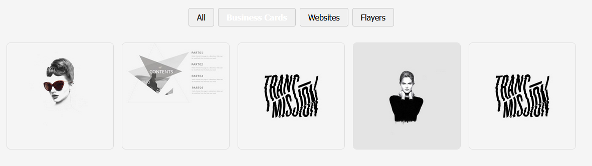

# Портфолио с фильтрами

[]()
[]()

[Условие домашнего задания](docs/assignment.md) 

[Демо "Портфолио"](https://DIvK-Neto.github.io/HW_12-2_events-state_filter/) 




Реализация портфолио с фильтрацией по категориям. Приложение состоит из трёх компонентов: `Portfolio` (классовый, с состоянием), `Toolbar` (панель фильтров) и `ProjectList` (сетка проектов). Фильтрация происходит при клике на кнопку, активный фильтр визуально выделен.

## 📚 Документация

- [Описание задания](docs/assignment.md) – полный текст ДЗ.
- [Функциональность](docs/features.md) – подробное описание возможностей.
- [Установка и запуск](docs/installation.md) – как развернуть проект локально.
- [Используемые технологии](docs/tech-stack.md) – стек и инструменты разработки.
- [Структура проекта](docs/file-structure.md) – организация файлов и папок.

## ✨ Особенности

- Три компонента с чётким разделением ответственности.
- Фильтрация без перезагрузки страницы.
- Адаптивная сетка (3/2/1 колонки).
- Код соответствует современным стандартам (ESLint, Prettier).

## 🚀 Быстрый старт

```bash
# Установка зависимостей
yarn install
```
```bash
# Запуск в режиме разработки
yarn dev
```